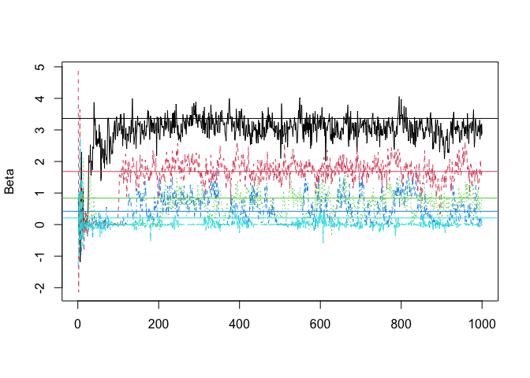
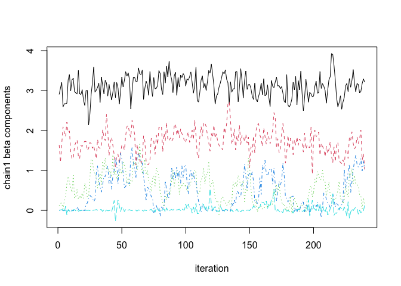
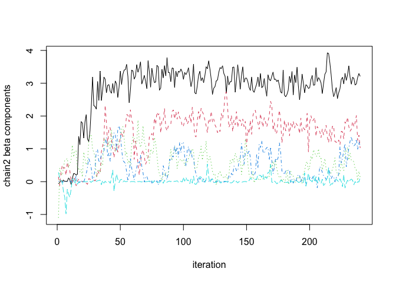
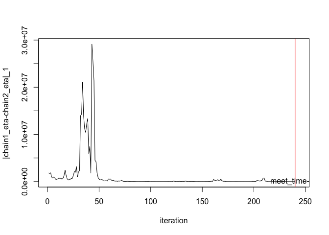
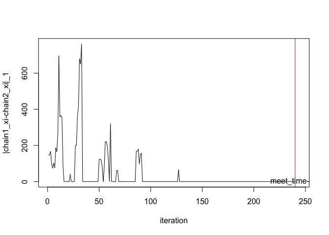
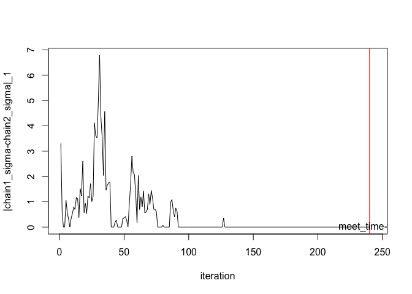

## CoupledHalfT

This package contains scripts to reproduce the results of article "Coupling-based convergence assessment of some Gibbs samplers for high-dimensional Bayesian regression with shrinkage priors", by Niloy Biswas, Anirban Bhattacharya, Pierre E. Jacob and James E. Johndrow (https://arxiv.org/abs/2012.04798).

### Installation

The package can be installed from R via:


```r
# install.packages("devtools")
devtools::install_github("niloyb/CoupledHalfT")
```

It depends on the packages Rcpp, RcppEigen, lubridate, which can be
installed via:


```r
install.packages(c("Rcpp", "RcppEigen", "lubridate"))
```

Additionally you might want to install other packages, to help with
parallel computation:


```r
install.packages(c("doParallel", "doRNG"))
```

and to help with manipulating results and plotting:


```r
install.packages(c("dplyr", "tidyr", "ggplot2", "viridis"))
```

### Tutorial

Generate synthetic data.


```r
set.seed(1)
library(CoupledHalfT)
library(dplyr)
# library(ggplot2)

# Synthetic dataset
n <- 100
p <- 500
s <- 20
true_beta <- matrix(0,p,1)
true_beta[1:s] = 2^(-(seq(s)/4-9/4))

X <- matrix(rnorm(n*p, mean = 0, sd = 1), nrow = n, ncol = p)
#Error terms
error_std <- 2
error_terms = error_std*rnorm(n, mean = 0, sd = 1)
y = X%*%true_beta + error_terms
X_transpose <- t(X)

# Half-t degree of freedom
t_dist_df <- 2
```

Run single chain MCMC and plot traceplots. 


```r
burnin <- 0
chain_length <- 1000
single_chain <- 
  half_t_mcmc(chain_length, burnin, X, X_transpose, y, t_dist_df=t_dist_df)
matplot(single_chain$beta_samples[,seq(2,20,4)], type = 'l', ylab = 'Beta')
abline(h=true_beta[seq(2,20,4)], col=c(1:5)) # Solid lines: true beta
```

<!-- -->

Run coupled MCMC and plot distance between chains. 


```r
lag <- 100
coupled_chain <- 
  coupled_half_t_mcmc(mc_chain_size=1, X, X_transpose, y, t_dist_df=t_dist_df, lag=lag)
print(paste('Lag: ',lag,'.',' L-lag Meeting time: ',coupled_chain$meetingtime,'.',sep = ''))
```

```
## [1] "Lag: 100. L-lag Meeting time: 339."
```

```r
# dim(coupled_chain$beta_samples1)
# dim(coupled_chain$beta_samples2)

par(mfrow=c(1,1))
matplot(coupled_chain$beta_samples1[2:(coupled_chain$meetingtime+2-lag),seq(2,20,4)], type = 'l',ylab = 'chain1 beta components', xlab = 'iteration')
```

<!-- -->

```r
matplot(coupled_chain$beta_samples2[1:(coupled_chain$meetingtime+1-lag),seq(2,20,4)], type = 'l',ylab = 'chain2 beta components', xlab = 'iteration')
```

<!-- -->

```r
par(mfrow=c(1,1))
matplot(rowSums(abs(coupled_chain$beta_samples1[2:(coupled_chain$meetingtime+2-lag),]-coupled_chain$beta_samples2[c(1:(coupled_chain$meetingtime+1-lag)),])), type='l', ylab = '|chain1_beta-chain2_beta|_1', xlab = 'iteration', xlim = c(1,(coupled_chain$meetingtime+5-lag)))
abline(v=(coupled_chain$meetingtime+1-lag), col='red')
text(x=(coupled_chain$meetingtime+1-lag), y=0, "meet_time-lag")
```

<!-- -->

```r
matplot(rowSums(abs(coupled_chain$eta_samples1[2:(coupled_chain$meetingtime+2-lag),]-coupled_chain$eta_samples2[c(1:(coupled_chain$meetingtime+1-lag)),])), type='l', ylab = '|chain1_eta-chain2_eta|_1', xlab = 'iteration', xlim = c(1,(coupled_chain$meetingtime+5-lag)))
abline(v=(coupled_chain$meetingtime+1-lag), col='red')
text(x=(coupled_chain$meetingtime+1-lag), y=0, "meet_time-lag")
```

<!-- -->

```r
matplot((abs(coupled_chain$xi_samples1[2:(coupled_chain$meetingtime+2-lag)]-coupled_chain$xi_samples2[c(1:(coupled_chain$meetingtime+1-lag))])), type='l', ylab = '|chain1_xi-chain2_xi|_1', xlab = 'iteration', xlim = c(1,(coupled_chain$meetingtime+5-lag)))
abline(v=(coupled_chain$meetingtime+1-lag), col='red')
text(x=(coupled_chain$meetingtime+1-lag), y=0, "meet_time-lag")
```

<!-- -->

```r
matplot((abs(coupled_chain$sigma2_samples1[2:(coupled_chain$meetingtime+2-lag)]-coupled_chain$sigma2_samples2[c(1:(coupled_chain$meetingtime+1-lag))])), type='l', ylab = '|chain1_sigma-chain2_sigma|_1', xlab = 'iteration', xlim = c(1,(coupled_chain$meetingtime+5-lag)))
abline(v=(coupled_chain$meetingtime+1-lag), col='red')
text(x=(coupled_chain$meetingtime+1-lag), y=0, "meet_time-lag")
```

<!-- -->

Run coupled MCMC and generate meeting times. 


```r
nrep <- 20
lag <- 500
tdist_meetingtimes_df <- data.frame()
for (i in 1:nrep){
  meetingtime <- meetingtime_half_t(X, X_transpose, y, t_dist_df=t_dist_df, lag=lag)
  tdist_meetingtimes_df <-
    rbind(tdist_meetingtimes_df, data.frame(meetingtime = meetingtime, lag=lag))
  print(c(i,meetingtime$meetingtime))
}
```

```
## [1]   1 747
## [1]   2 761
## [1]   3 800
## [1]   4 815
## [1]   5 815
## [1]   6 787
## [1]   7 785
## [1]   8 807
## [1]   9 817
## [1]  10 816
## [1]  11 875
## [1]  12 763
## [1]  13 836
## [1]  14 913
## [1]  15 755
## [1]  16 845
## [1]  17 768
## [1]  18 707
## [1]  19 738
## [1]  20 831
```

Plot L-lag total variation bounds.


```r
# Plotting L-Lag TV bounds
tv_upper_bound_estimates <- 
  function(coupling_times, L, t){return(pmax(0,ceiling((coupling_times-L-t)/L)))}

# TV UB from a dataframe
tv_upper_bound_estimates_df <- function(df, time){
  Llagmeetingtimes <- df$meetingtime.meetingtime
  lag <- (df$lag) # df$lag should have one unique value
  tv_ub <- colMeans(sapply(time, function(x) tv_upper_bound_estimates(coupling_times = Llagmeetingtimes, L=lag, x)))
  return(data.frame(t=time, tv_ub=tv_ub))
}

# TV UB Plot
time <- c(0:1000)
tv_ub_df <- tdist_meetingtimes_df %>% 
  dplyr::do(tv_upper_bound_estimates_df(df=., time=time))
plot(x=tv_ub_df$t, y=tv_ub_df$tv_ub, type = 'l', xlab = 'iteration', 
     ylab = 'Total variation distance')
```

<!-- -->

